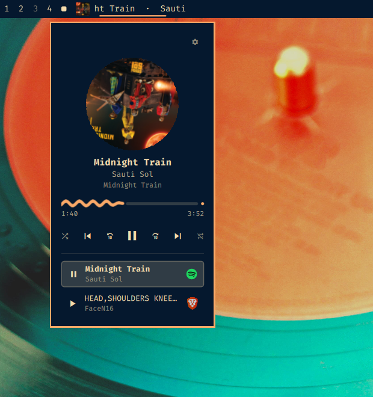

# Media++

An Omarchy shell media plugin. It does everything `omarchy.media` does, plus
seeking, shuffle and repeat, a settings panel, hotkeys, and two ways of drawing
the artwork and the progress bar.



## Install

```bash
omarchy plugin add <repo-url>
omarchy plugin enable ajkulundu.mediaplusplus
```

Requires a Nerd Font for the transport glyphs — Omarchy ships one.

### Removing it

```bash
omarchy plugin disable ajkulundu.mediaplusplus   # stop loading it, keep the checkout
omarchy plugin remove ajkulundu.mediaplusplus    # delete the checkout as well
```

Media++ is a clone of the first-party `omarchy.media`, so disabling or removing
it puts the stock plugin back into the same bar slot rather than leaving a gap:
the layout entry's id flips to `omarchy.media` and the built-in is re-enabled
for you. The inline settings on that entry are left untouched.

Either way, plugin changes only take effect on the next shell start:

```bash
omarchy restart shell
```

That restart is also what reclaims the memory — Qt caches compiled QML for the
life of the process, so disabling alone frees nothing.

## Bind the summon key

Media++ does not claim a global shortcut for you. Bind one yourself, in
`~/.config/hypr/bindings.lua`:

```lua
o.bind("SUPER + ALT + M", "Media controls", "omarchy-shell shell toggle ajkulundu.mediaplusplus")
```

That toggles the popup on the focused monitor. Every key in the next section
works while the popup is open.

## Features and hotkeys

| | Stock | Media++ | Key |
|---|---|---|---|
| Play / pause | ✓ | ✓ | `space` |
| Previous / next track | ✓ | ✓ | `p` / `n` |
| Seeking | — | Scrub bar, ± buttons, `seekTo`/`seekPercent` over IPC | `b` / `f`, `←` / `→` |
| Shuffle | — | With per-player support detection | `x` |
| Repeat | — | Off · all · track | `r` |
| Source switching | Title only | App icon per source, click a row to switch | `[` / `]` |
| Raise the player | — | Click the cover to focus the player's own window | `o` |
| Artwork | Fixed square thumbnail | Aspect-driven frame, or a spinning vinyl | `v` |
| Progress bar | — | Plain, Material 3 Expressive wiggle, or Pac-Man | `y` |
| Position on bar | — | Left · center · right | `m` |
| Settings panel | — | In-popup: bar position, artwork, progress style | `s` |
| Close the popup | — | — | `esc` |
| Bar label | Resizes with the title | Fixed width, continuous carousel | — |

Keys are matched on the character, so they follow your keyboard layout. Seeking
repeats when held; everything else acts once per press, so leaning on `space`
will not machine-gun play/pause.

It also fixes several things the stock plugin gets wrong: the bar label can
strand itself off-screen and vanish; secondary text inverts its contrast on
light themes, ending up louder than the title above it; and a player that has
stopped but still advertises stale cover art outranks one holding a real
paused track, which hides the widget entirely.

## Bar widget

Cover thumbnail plus track and artist, at a fixed width so the bar does not
reflow on every track change. Long titles scroll as a continuous carousel with
a pause between passes. The thumbnail dims while paused. Left click opens the
popup; nothing else on the bar is clickable, so a stray scroll cannot skip a
track.

## Popup

Artwork, track metadata, a scrub bar with elapsed and total time, and a
transport row: shuffle · previous · back · play/pause · forward · next · repeat.
Controls a player does not support are dimmed rather than hidden. Clicking the
cover asks the player to bring its own window forward. When more than one
player is running, each appears in a list below with its app icon; the list
scrolls once it is taller than a few rows rather than growing the popup.

### Untrusted artwork

`trackArtUrl` is attacker-influenced: a web page sets it through the
MediaSession API and the browser passes it straight to MPRIS. Every cover is
therefore decoded inside a fixed bounding box on **both** axes, so no source
shape can blow up the decode — a 120000x200 PNG of flat colour is 69 KB on the
wire and decodes to 92 MB of RGBA if only one axis is capped, because Qt scales
an image down but never up and so leaves an already-short image at its full
width. With the box, the ceiling is the box regardless of input, and the frame
takes its aspect ratio from the pixmap Qt actually produced rather than from
the box.

## Settings

Gear icon, top right of the popup.

| Setting | Options | Default |
|---|---|---|
| Position on bar (`m`) | Left · Center · Right | Left |
| Popup artwork (`v`) | Square · Vinyl | Square |
| Progress animation (`y`) | Plain · Wiggle · Pac-Man | Plain |

**Square** keeps the cover's own aspect ratio; **Vinyl** fills a record that
turns while playing. **Wiggle** is Material 3 Expressive's wave, flattening
when playback pauses; **Pac-Man** eats his way along a row of pellets — the
pellets ahead are what is left to play, the cleared line behind is what has
gone. He travels with his mouth shut, marked by a seam so he still reads as
Pac-Man at rest rather than as a plain dot, and opens it only to take a pellet:
the bite is fired by arriving at a dot, not by a timer, so it always lands on
one. He takes the accent colour like every other indicator, so he follows your
theme rather than importing arcade yellow into it.

The earlier barber-pole **Stripes** style was replaced by Pac-Man in v1.2.0. A
config still holding `"stripes"` is read as `"pacman"`, so the choice of a drawn
bar is preserved rather than falling back to the plain one.

Anything not exposed in the panel is an inline field on the widget's entry in
`~/.config/omarchy/shell.json`:

```json
{ "id": "ajkulundu.mediaplusplus",
  "labelWidth": 136, "scrollSpeed": 0.6, "scrollPause": 5, "seekStep": 10,
  "artworkStyle": "square", "progressAnimation": "default" }
```

`labelWidth` is the bar label width, `scrollSpeed` multiplies the carousel pace
(below 1 is slower), `scrollPause` is the hold between passes in seconds, and
`seekStep` is how far the ± buttons and `b`/`f` jump. `seekStep` is one of 5,
10, 15 or 30 — anything else snaps to the nearest, so the button icon always
shows the number it actually seeks.

## IPC

```bash
omarchy-shell media status        # JSON: track, position, length, shuffle, loop
omarchy-shell media playPause
omarchy-shell media seek -10      # relative seconds
omarchy-shell media seekTo 90     # absolute seconds
omarchy-shell media seekPercent 50
omarchy-shell media shuffle
omarchy-shell media loop          # off -> all -> track
omarchy-shell media raise         # focus the player's own window
omarchy-shell media sourceNext
```

`status` also reports `canRaise`.

## Dismissal

The popup closes on `esc`, on clicking outside it, on clicking the bar widget,
on the summon hotkey, or shortly after the pointer leaves it — but only once the
pointer has actually been on it, so opening by hotkey with the mouse elsewhere
stays put.

The popup is a full-screen layer surface, which is what lets it hold keyboard
focus for as long as it is open. Earlier versions anchored an xdg popup to the
bar and borrowed focus through a 1×1 helper surface; that surface could win
focus but not keep it, so the hotkeys went dead roughly 75 ms after opening and
keys fell through to whatever was behind — which, with a browser there, meant
`space` and `f` hit YouTube instead. Holding focus properly also means
`focus_follows_mouse` no longer steals the hotkeys when the pointer wanders.

## Tests

The selection, stream-matching and formatting logic lives in `MediaModel.js`,
which is deliberately free of QML imports — enum values are passed in by the
caller — so it runs outside a shell:

```bash
node MediaModel.test.js
```

## Credit

Cloned from Omarchy's first-party `omarchy.media` and extended from there.

## License

MIT
